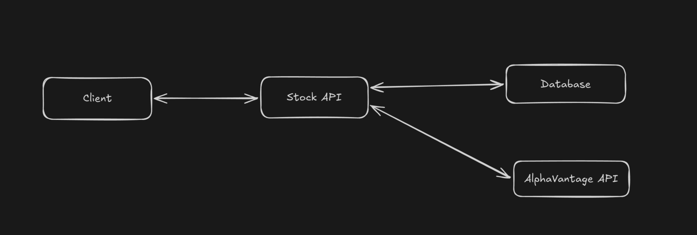

# Stock Analyzer API

This is an API that allows consumers to view a summary of the market data for
particular time period

```hurl
GET /symbols/IBM/annual/2005

returns:
{
"high": "80.8700",
"low": "76.0600",
"volume": "139457800"
}
```

The API should provide information on high, low, and volume by aggregating 12 monthly data
points for the particular stock symbol provided

```
definitions:
    - high => the highest price for {symbol} within {year}
    - low => the lowest price for {symbol} within {year}
    - volume => the aggregated sum of volume traded monthly for {symbol} within {year}
```

data is sourced from the following third party API:
`https://www.alphavantage.co/documentation/#monthly`

The API provides historical data for the past 20 years categorized by month the response
would look like the following

```
{
  "Meta Data": {
    "1. Information": "Monthly Prices (open, high, low, close) and Volumes",
    "2. Symbol": "IBM",
    "3. Last Refreshed": "2026-05-07",
    "4. Time Zone": "US/Eastern"
  },
  "Monthly Time Series": {
    "2026-05-07": {
      "1. open": "234.5500",
      "2. high": "235.9500",
      "3. low": "224.3800",
      "4. close": "231.3100",
      "5. volume": "24965792"
    },
    "2026-04-30": {
      "1. open": "242.1200",
      "2. high": "258.5000",
      "3. low": "221.7300",
      "4. close": "230.9800",
      "5. volume": "133524534"
    },
    "2026-03-31": {
      "1. open": "235.7000",
      "2. high": "260.3800",
      "3. low": "233.7500",
      "4. close": "242.3900",
      "5. volume": "123042788"
    },
    "2026-02-27": {
      "1. open": "307.5100",
      "2. high": "316.6400",
      "3. low": "220.7200",
      "4. close": "240.2100",
      "5. volume": "143357654"
    },
    ...
  }
}
```

> Note: The data for the past months are mostly static but the data for the
> current month rolls out daily we would need to consider this when requests comes
> for the current year 



## Scenarios to cover

### User/Client request market summary for a given year and symbol

**Flow**:
- [ ] User requests summary of a symbol for a particular year using a GET request
- [ ] Check the database if the symbol data is present
    - [ ] if the year provided in the request is not current year fetch the
    related data from database and respond
    - [ ] if the year provided is greater than the last refreshed date year
    compare the last fetched date vs current date and if it is greater than
    24hrs fetch the data again respond the user with values and update the
    database, if it is less than 24 hrs respond directly from database
- [ ] if the symbol data is not present in the database, request from the
AlphaVantage API, process and store data and respond the client with the
required data

**Error scenarios**
- [ ] Invalid year/symbol provided => status 400 + error message
- [ ] No data found for symbol => status 404 + error message
- [ ] couldn't connect to AlphaVantage API => status 503 + error message
    

## Schema

The following two tables will be used for the data storage

```sql
TABLE symbol {
    symbol TEXT PRIMARY KEY,
    info TEXT,
    last_refreshed DATE,
    timezone TEXT
}

TABLE prices_monthly {
    symbol TEXT,                    -- foreign key
    month_start_date TEXT,
    last_refreshed TEXT,            -- actual date in the response
    open REAL,
    close REAL,
    high REAL,
    low REAL,
    volume INEGER,
    PRIMARY KEY (symbol, month_start_date)
}

```

## 3rd party dependencies used
- Pydantic: helps with type checking and data validation
- FastAPI: framework for building APIs
- Pydantic Settings: helps with managing environment variable and configurations
- httpx: provides a HTTP client with async capabilities
- aiosqlite: provides an async wrapper capabilities sqlite

